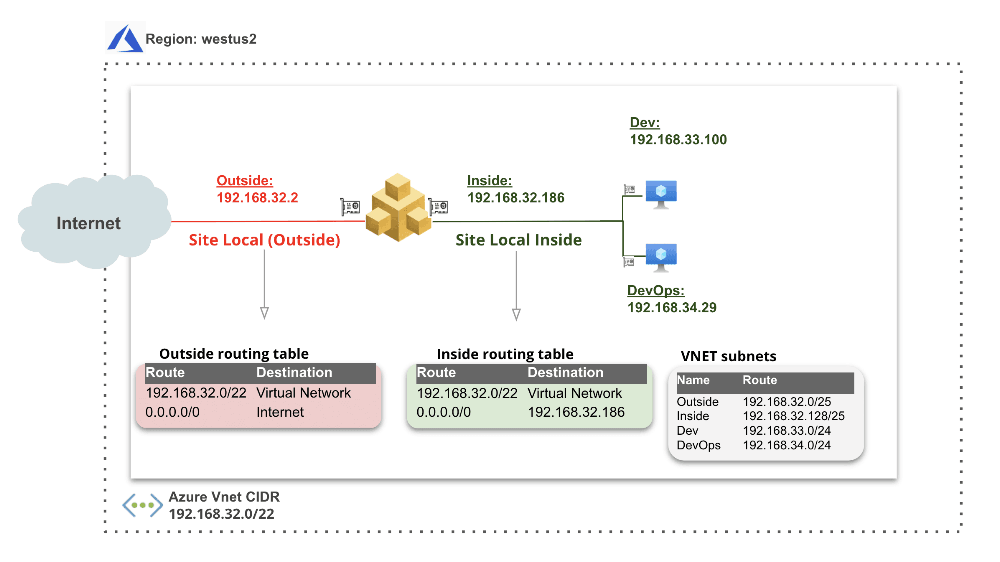

F5XC Customer Edge Load Balancer
================================

**Objective**:

Create an F5XC TLS Load Balancer with custom advertisement

In this deployment scenario, the Mesh nodes need two interfaces attached. The first interface is the outside interface through which services running on the node can connect to the Internet.

As shown in the below figure, the outside interface is on the outside subnet which is associated with the outside subnet route table, whose default route is pointing to the Internet gateway. This interface can send and receive traffic from the Internet. In case of inside subnets, these are associated with the inside subnet route table which is also the main route table for this VNet, meaning that any newly created subnet in this VNet is automatically associated with the inside subnet route table. This private subnet route table has a default route pointing to the inside IP address of the Mesh node (192.168.0.186).

|image01|

.. note:: You should use the delegated domain of your F5XC tenant, this will allow you to automatically generate a TLS certificate

**Why**:

Application Delivery of local services is a primary use case for F5XC and other F5 products. Utilizing a local customer-edge solution provides consumers with another choice pointed in the direction of **SaaS** or **Cloud-First** strategies. A consumer can utilize the console for the creation of the infrastructure and configuration management. Upgrade/Updates are a simple push, shareable objects can be reused across different sites, and analytics are centralized.

**How**:

https://docs.cloud.f5.com/docs/how-to/app-networking/http-load-balancer
https://docs.cloud.f5.com/docs/how-to/advanced-app-nwg/advertise-apps-on-site-service-network

**Validation**: 

How did you access this local-only advertisement of our application? 

