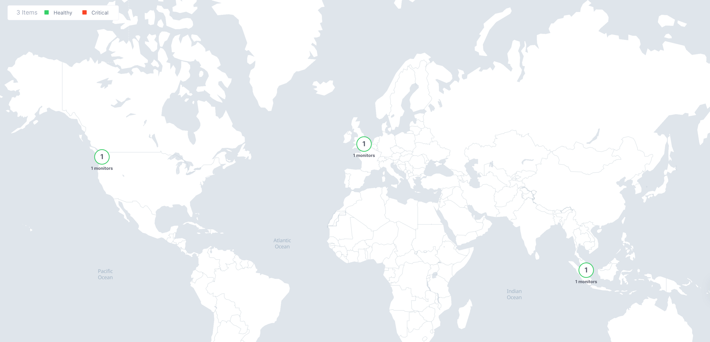

Advanced HTTP Synthetic Monitor
===============================

In software design, web design, and electronic product design, synthetic monitoring (also known as active monitoring or proactive monitoring) is a monitoring technique that is done by using a simulation or scripted recordings of transactions. Behavioral scripts (or paths) are created to simulate an action or path that a customer or end-user would take on a site, application, or other software (or even hardware). Those paths are then continuously monitored at specified intervals for performance, such as functionality, availability, and response time measures.

Source: https://en.wikipedia.org/wiki/Synthetic_monitoring

**Objective**:

Create an Advanced HTTP Synthetic Monitor for the NGINX application servers, originate these monitors from 3 different continents. 

|image01|

**Why**:

User experience and uptime are the forethought of successful organizations. With synthetic monitoring in F5XC consumers can experience how various geographic locations perform against an application. 

**How**:

Advanced HTTP Synthetic Monitor

Source: https://docs.cloud.f5.com/docs/how-to/synthetic-monitoring

