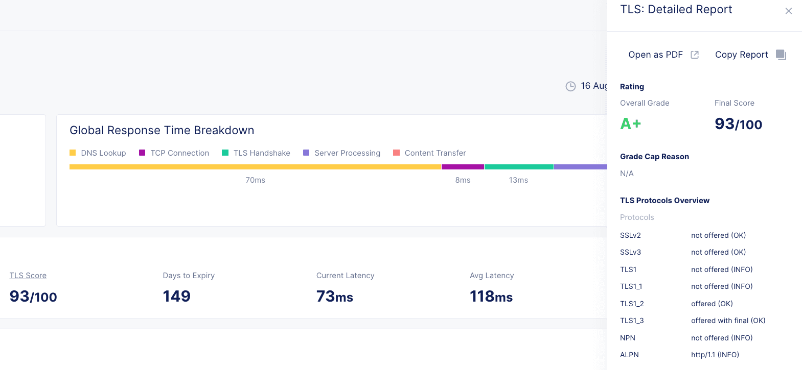

Synthetic Monitor TLS Report
============================

Strong SSL/TLS settings on an external footprint of an application are the first step in application security. F5XC can generate a Qualys SSLLabs report while testing an available application.

**Objective**:

Generate a TLS Score Report

|image02|

**Why**:

Periodic testing of external TLS endpoints can proactively identify problems a consumer may find. Proxy solutions and Firewalls will change their presentation of TLS ciphers available for negotiation in different versions. Validating these kinds of changes after upgrades is extremely helpful.

**How**:

Expose the NGINX application servers with a TLS endpoint. 

Possible TLS endpoints to use:
  - F5XC Load Balancer
  - BIG-IP
  - NGINX
  - Platform native load balancer

Synthetic Monitor TLS Report

Source: https://docs.cloud.f5.com/docs/how-to/synthetic-monitoring/tls-report

