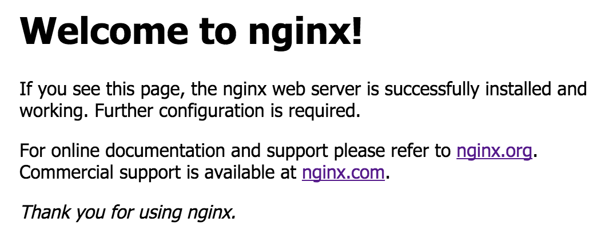

NGINX Welcome Site
==================

**Objective**: 

Use a browser to load the default NGINX page

**Why**: 

Before we load specific configurations into NGINX, validating that the default page is available lets us if services and firewalls are allowing access.

**How**:

Use a browser to make sure the default NGINX page loads

|image01|

.. warning:: The default page is only available on HTTP

Troubleshooting:

  - Verify the NGINX service is running

   .. code:: 
   sudo systemctl status nginx
   
   .. code:: 
   HTTP://<nginx ip address>

  - Verify any security groups or firewalls allow clients

