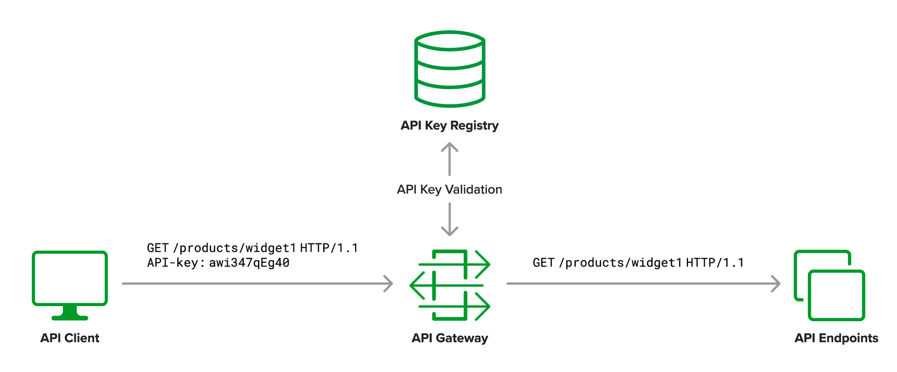

API Keys
========

**Objective**: 

Enable API Keys validation with NGINX

**Why**: 

Public REST services without access control run the risk of being farmed leading to excessive bills for bandwidth or compute cycles. API keys can be used to mitigate this risk. They are also often used by organisation to monetize APIs; instead of blocking high-frequency calls, clients are given access in accordance to a purchased access plan

API keys can reduce the impact of denial-of-service attacks. However, when they are issued to third-party clients, they are relatively easy to compromise

- Require API keys for every request to the protected endpoint
- Return 429 Too Many Requests HTTP response code if requests are coming in too quickly
- Revoke the API key if the client violates the usage agreement
- Do not rely exclusively on API keys to protect sensitive, critical or high-value resources

**How**:

API keys/tokens are a low-level authorization method, however, these keys/tokens are commonly used to track API consumption for monetization.

|image04|

.. note:: Most proxy pass solutions require a Host header to be added since NGINX defaults to passing the original Host header.

Example Documentation:

- https://www.nginx.com/blog/deploying-nginx-plus-as-an-api-gateway-part-1 *API Key Authentication*

NGINX Documentation:

- https://nginx.org/en/docs/http/ngx_http_auth_request_module.html#auth_request
- http://nginx.org/en/docs/http/ngx_http_proxy_module.html#proxy_pass
- http://nginx.org/en/docs/http/ngx_http_proxy_module.html#proxy_pass_header

