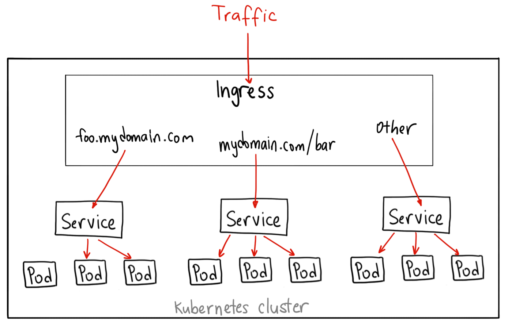

F5 NGINX Kubernetes Ingress
===========================

**Objective**: Install F5 NGINX Kubernetes Ingress

The Ingress Controller is an application that runs in a cluster and configures an HTTP load balancer according to Ingress resources. The load balancer can be a software load balancer running in the cluster or a hardware or cloud load balancer running externally. Different load balancers require different Ingress Controller implementations.

In the case of NGINX, the Ingress Controller is deployed in a pod along with the load balancer.

Source: https://docs.nginx.com/nginx-ingress-controller/intro/overview/

**Why**: 

NGINX Ingress Controller provides a robust feature set to secure, strengthen, and scale your containerized apps, including:

  Advanced app-centric configuration - Use role-based access control (RBAC) and self-service to set up security guardrails (not gates), so your teams can manage their apps securely and with agility. Enable multi-tenancy, reusability, simpler configs, and more.

  Visibility and performance monitoring - Pinpoint undesirable behaviors and performance bottlenecks to simplify troubleshooting and make fixes faster.

  NGINX Ingress resources - A native, type-safe, and indented configuration style to simplify capabilities like circuit breaking, sophisticated routing, header manipulation, mTLS authentication, and WAF. 
  
Plus if you are already using NGINX, NGINX Ingress resources make it easy to adapt existing configuration from your other environments.

Source: https://www.nginx.com/products/nginx-ingress-controller/

Compare Community Ingress Offerings

https://docs.google.com/spreadsheets/d/191WWNpjJ2za6-nbG4ZoUMXMpUK8KlCIosvQB0f-oq3k/edit#gid=907731238

|image02|

**How**:

Building the Ingress Controller Image
  - https://docs.nginx.com/nginx-ingress-controller/installation/building-ingress-controller-image

Installation with Manifests
  - https://docs.nginx.com/nginx-ingress-controller/installation/installation-with-manifests/

