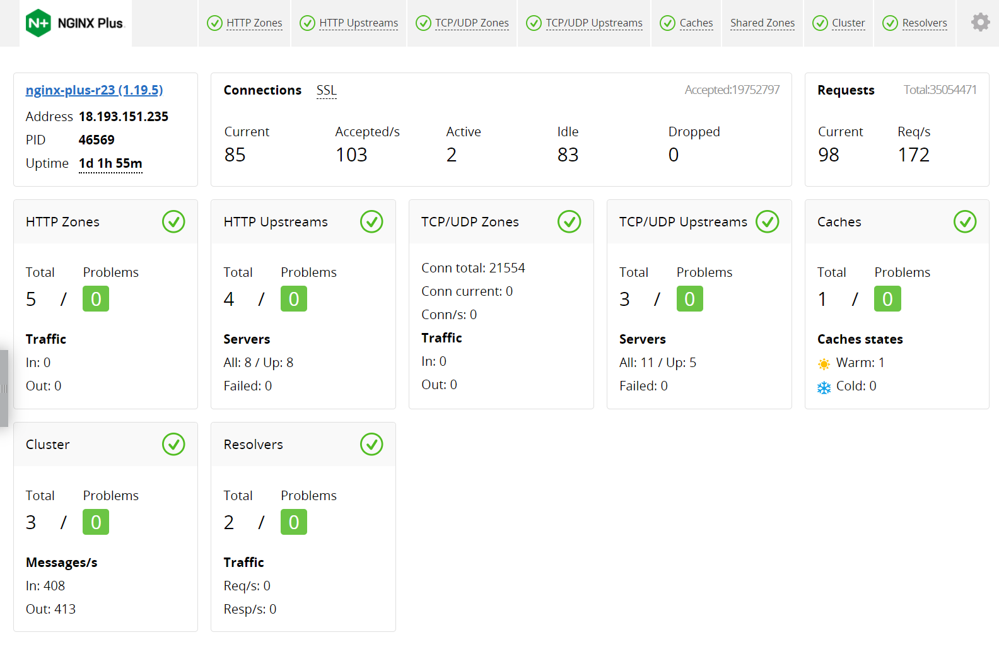

F5 NGINX Kubernetes Ingress real-time activity and API
======================================================

**Objective**: Show the NGINX Plus Dashboard and API

NGINX Plus includes a real-time activity monitoring interface that provides key load and performance metrics. Using a simple RESTful JSON interface, it is very easy to connect these stats to live dashboards and third-party monitoring tools.

Source: https://www.nginx.com/products/nginx/live-activity-monitoring/

Live Example: https://demo.nginx.com/

The ngx_http_api_module module (1.13.3) provides REST API for accessing various status information, configuring upstream server groups on-the-fly, and managing key-value pairs without the need of reconfiguring nginx.

Source: https://nginx.org/en/docs/http/ngx_http_api_module.html

Live Example: https://demo.nginx.com/swagger-ui/

|image03|

**Why**: 

API and Analytics are production level first-class citizens. Highlighting these differentiates the commercial offerings from opensource. 

**How**:

NGINX Ingress Controller Dashboard and API:
  - https://docs.nginx.com/nginx-ingress-controller/logging-and-monitoring/status-page/

